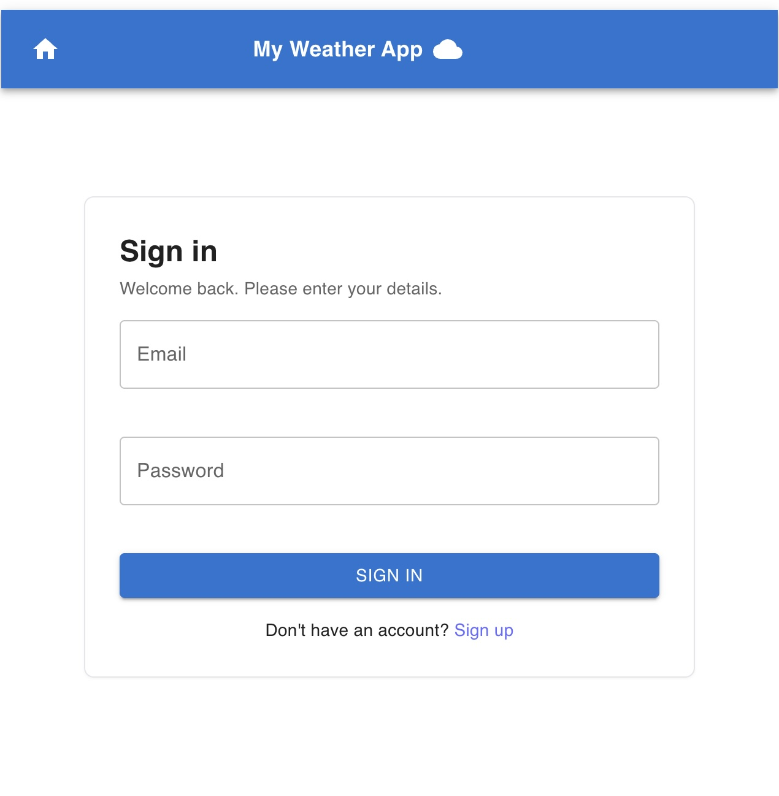
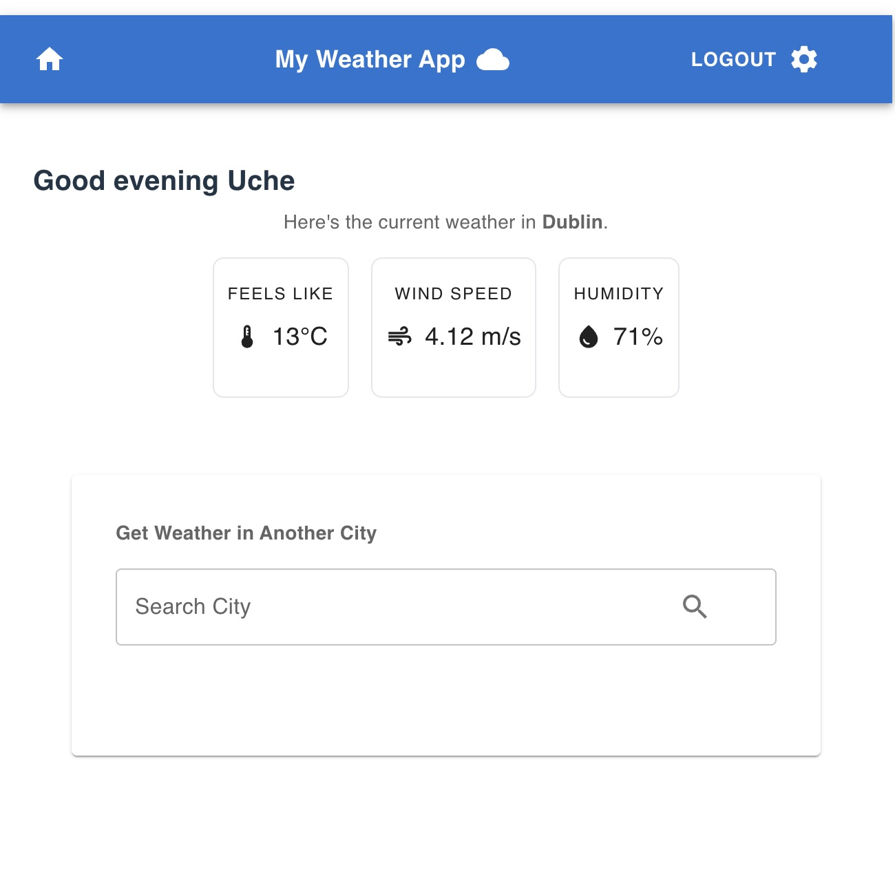
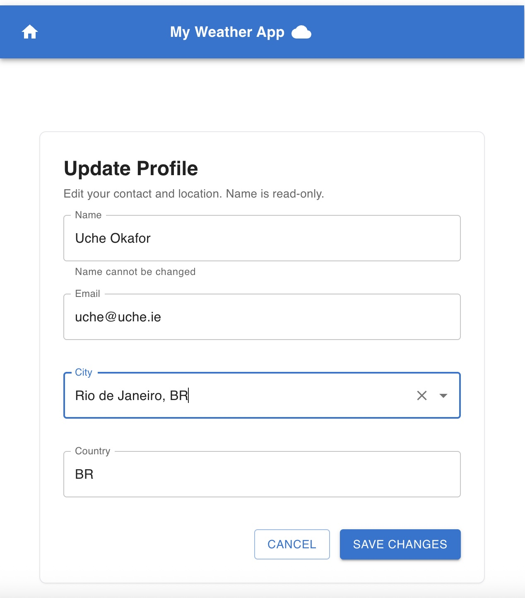

# 🌦️ My Weather App

A full-stack weather application built with **React + Material UI (MUI)** on the frontend and **Node.js + Express + MongoDB** on the backend.  
Users can search for a city, view current weather, and manage personalized settings through an authenticated dashboard.


---

## 🔗 Live Demo

**Production:** https://react-weather-app-sand-one.vercel.app

---

## 🚀 Features


### Frontend
- 🔍 **City Search with Autocomplete**  
  Type in a city name and get dynamic suggestions powered by the OpenWeather Geocoding API.

- 🏙️ **City Selection**  
  Selecting a suggestion updates the input automatically.

- ☁️ **Weather Fetch**  
  Clicking the search button fetches current weather details (via the OpenWeather API).

- 📄 **Weather Display**  
  Results are shown in a responsive **MUI Paper component** with:
  - Description + weather icon  
  - Temperature in °C  
  - Wind speed (m/s)  
  - Humidity (%)  

- 📱 **Responsive UI**  
  Works seamlessly across desktop and mobile with adaptive layouts.

---

### Backend
- 🔐 **Authentication**  
  - Register and login with secure JWT tokens.  
  - Tokens stored in localStorage and validated on each request.  
  - Protected routes (e.g., dashboard).  

- 🧑 **User Profile Management**  
  - Update profile details (email, city, country, latitude, longitude).  
  - Validations enforced with **Zod** and Express middleware.  

- 🌍 **Weather API Proxy**  
  - Frontend requests go through the backend (no exposed API keys).  
  - Consistent error handling with custom error classes. 
---

## 🛠️ Tech Stack

**Frontend**
- React (Vite)  
- Material UI (MUI)  
- Axios (with interceptors)  

**Backend**
- Node.js + Express  
- MongoDB + Mongoose  
- Zod (schema validation)  
- JWT (authentication)  

**APIs**
- OpenWeather (Geocoding + Weather)  

---

## ⚙️ How It Works

### Frontend Flow
1. User types a city → triggers `text` state update.  
2. Fetch for matching cities → updates `cityOptions` state.  
3. Selecting a city updates `selectedCity`.  
4. Clicking search → requests backend weather endpoint.  
5. Weather data returned and displayed in MUI components.  

### Backend Flow
1. **Auth Routes**  
   - `POST /auth/register` → creates user.  
   - `POST /auth/login` → validates credentials, returns JWT.  
   - `GET /auth/me` → returns current user based on token.  

2. **User Routes**  
   - `PATCH /user/update` → update profile details.  

3. **Weather Routes**  
   - `GET /weather` → fetches weather from OpenWeather API (proxied). 

---

## 📸 Screenshots

### Autocomplete Search Feature
  

### Mobile Device View


### Desktop View
  

### Login Page
  

### Dashboard
  

### Update Info Page
 

### Post Update Page
  

---

## 🔑 Environment Variables

This project requires API keys from [OpenWeather](https://openweathermap.org/api).  
Create a `.env` file in the root directory and add:

```bash
VITE_CITY_API_KEY=your_api_key_here
VITE_WEATHER_API_KEY=your_api_key_here

---

```

---

## 📚 What I Learned

- Structuring a full-stack project with client and server.  
- Managing multiple pieces of state (`text`, `cityOptions`, `selectedCity`, `weatherDetails`) effectively.  
- Designing an Express backend with routes, middleware, and error handling.
- Using MongoDB + Mongoose with Zod for robust validation. 
- Implementing JWT authentication and protecting routes.
- Connecting React frontend to a Node.js backend with Axios interceptors.

---

## 💡 Future Improvements

- ⭐ Save favorite cities in user profiles.  
- 🔄 Refresh weather data automatically every few minutes.  
- 🌑 Add dark mode toggle for better UX.  

---

## ▶️ Getting Started

### Clone the repository:

```bash
git clone https://github.com/<your-username>/my-weather-app.git
cd my-weather-app
```

### Backend Setup

```bash
cd server
npm install
npm run dev
```
Runs on http://localhost:5000.

### Frontend Setup

```bash
cd client
npm install
npm run dev
```
Runs on http://localhost:5173.

Make sure both backend and frontend servers are running simultaneously for the app to function correctly.


